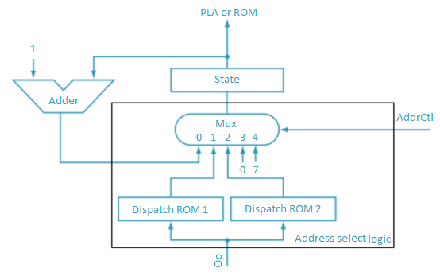
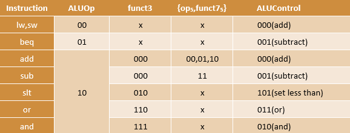
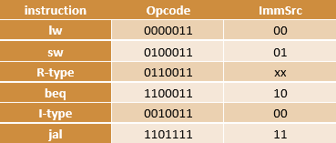

<h1 align="center"> multi-cycle RISC-V microprogrammed processor </h1>
<h3 align="center"> Computer Architecture </h3>
<h5 align="center"> Final Project - <a href="https://en.sbu.ac.ir/">Shahid Beheshti University</a>(2023) </h5>

<!-- TABLE OF CONTENTS -->
<h2 id="table-of-contents"> Table of Contents</h2>
<ul>
  <li><a href="#about-the-project">About The Project</a></li>
  <li><a href="#description">Description</a></li>
  <ul>
    <li><a href="#memory">Memory</li>
    <li><a href="#data_path">Data Path</li>
    <li><a href="#controller">Controller</li>
  </ul>
</ul>

<!-- ABOUT THE PROJECT -->
<h2 id="about-the-project">About The Project</h2>

This project focuses on designing and implementing a multi-cycle RISC-V processor using microprogrammed control that can execute these instructions:

<ul>
  <li><b>R-type instructions</li>
  <li><b>I-type instructions</li>
  <li><b>lw</li>
  <li><b>sw</li>
  <li><b>beq</li>
  <li><b>jal</li>
</ul>

The synthesis stages assume the execution of the design on the DE1-SoC board.

<!-- DESCRIPTION -->
<h2 id="description">Description</h2>

The processor consists of three main units:

  

<!-- MEMORY DESCRIPTION -->
<h3 id="memory">Memory:</h3>

The memory unit is responsible for storing both instructions and data.

<!-- DATA PATH DESCRIPTION -->
<h3 id="data_path">Data path:</h3>

Multi-cycle data paths break up instructions into separate steps. The steps based on the executing instruction, are as follows:

Therefore the data path consists of a Register File, ALU, Extend unit, several multiplexers for picking up the input of other units, and 5 Nonarchitectural registers to hold the results of each step:

  

Each functional unit can be used more than once in an instruction, as long as it is used in different clock cycles.

<!-- CONTROLLER DESCRIPTION -->
<h3 id="controller">Controller:</h3>

The controller results in the instructions to be implemented by constructing a definite collection of signals at each system clock cycle. Each of these output signals generates one micro-operation including register transfer. Thus, the sets of control signals are generated definite micro-operations that can be saved in the internal memory.

Each bit that forms the microinstruction is linked to one control signal. When the bit is set, the control signal is active. When it is cleared the control signal turns inactive. These microinstructions in a sequence can be saved in the internal ’control’ memory:

  

<h4>Advantages of Microprogrammed Control Unit</h4>
<ul>
  <li><b>It can more systematic design of the control unit.</li>
  <li><b>It is simpler to debug and change.</li>
  <li><b>It is used to control functions implemented in software and not hardware.</li>
  <li><b>It is more flexible.</li>
</ul>
<h4>Disadvantages of Microprogrammed Control Unit</h4>
<ul>
  <li><b>Adaptability is obtained at more cost.</li>
  <li><b>It is slower than a hardwired control unit.</li>
</ul>

To execute an instruction, we require logic that produces the correct control signals by generating inputs to the ROM. This logic is called address select logic. It determines the next micro-operation based on the current micro-operation and the opcode of the instruction.

    

There is a multiplexer that selects which one of its inputs will be the address for the next micro-operation. Based on the executing instruction and the current execution stage, the following scenarios are considered:

<ol>
  <li>The micro-operation that comes after the current micro-operation in the ROM should be executed precisely. This is implemented using an Adder.</li>
  <li>In the decode state, the next state is determined based on the opcode. this is implemented using the Dispatch ROM 1.</li>
  <li>In the MemAdr state, the next state is determined based on the opcode, and this is implemented using the Dispatch ROM 2.</li>
  <li>When the instruction is completed, the next state is the Fetch state.</li>
  <li> In the ExecuteR, ExecuteI, and JAL states, the next state is the ALUWB state.</li>
</ol>

The controller module also consists of an ALU Decoder and Instr Decoder. The ALU Decoder produces ALUControl based on ALUOp and funct3. In the case of the sub and add instructions, the ALU Decoder also uses funct75 and op5 to determine ALUControl, as given in the table below:

  

A small Instruction Decoder combinationally produces the ImmSrc select signal based on the opcode using the table below:

  

