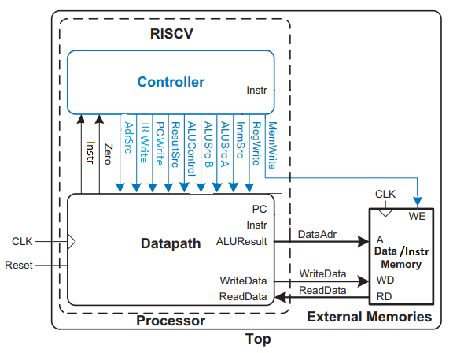
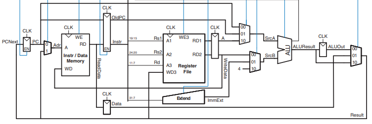
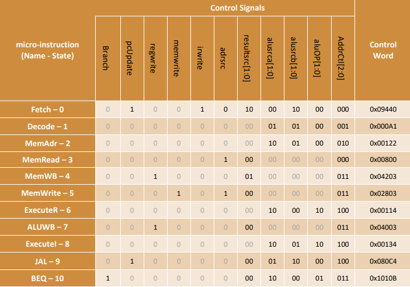

# RISC-V_Microprogrammed

<!-- TABLE OF CONTENTS -->
<h2 id="table-of-contents"> Table of Contents</h2>
<ol>
  <li><a href="#about-the-project">About The Project</a></li>
  <li><a href="#description">Description</a></li>
</ol>

<!-- ABOUT THE PROJECT -->
<h2 id="about-the-project">About The Project</h2>

This project focuses on designing and implementing a multi-cycle RISC-V processor using microprogrammed control that can execute these instructions:

<ul>
  <li><b>R-type instructions</li>
  <li><b>I-type instructions</li>
  <li><b>lw</li>
  <li><b>sw</li>
  <li><b>beq</li>
  <li><b>jal</li>
</ul>

The synthesis stages assume the execution of the design on the DE1-SoC board.

<!-- DESCRIPTION -->
<h2 id="description">Description</h2>

The processor consists of three main units:

  

<!-- MEMORY DESCRIPTION -->
<h3>Memory:</h3>

The memory unit is responsible for storing both instructions and data.

<!-- DATA PATH DESCRIPTION -->
<h3>Data path:</h3>

Multi-cycle data paths break up instructions into separate steps. The steps based on the executing instruction, are as follows:

Therefore the data path consists of a Register File, ALU, Extend unit, several multiplexers for picking up the input of other units, and 5 Nonarchitectural registers to hold the results of each step:

  

Each functional unit can be used more than once in an instruction, as long as it is used in different clock cycles.

<!-- CONTROLLER DESCRIPTION -->
<h3>Controller:</h3>

The controller results in the instructions to be implemented by constructing a definite collection of signals at each system clock cycle. Each of these output signals generates one micro-operation including register transfer. Thus, the sets of control signals are generated definite micro-operations that can be saved in the internal memory.

Each bit that forms the microinstruction is linked to one control signal. When the bit is set, the control signal is active. When it is cleared the control signal turns inactive. These microinstructions in a sequence can be saved in the internal ’control’ memory:

  

