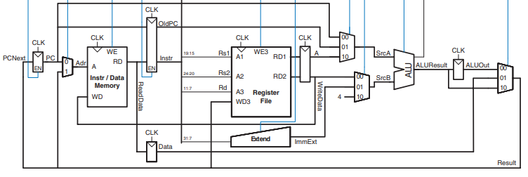
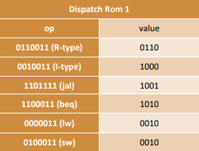
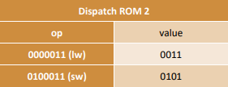
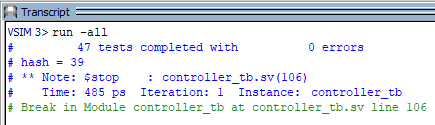
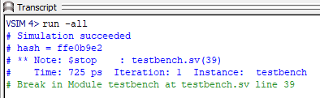

<h3>     </h3>
<h1 align="center"> Multi-cycle RISC-V microprogrammed processor </h1>
<h3 align="center"> Computer Architecture </h3>
<h5 align="center"> Final Project - <a href="https://en.sbu.ac.ir/">Shahid Beheshti University</a>(2023) </h5>
<h3>      </h3>

<!-- TABLE OF CONTENTS -->
<h2 id="table-of-contents"> Table of Contents</h2>
<ul>
  <li><a href="#about-the-project">About The Project</a></li>
  <li><a href="#description">Description</a></li>
  <ul>
    <li><a href="#memory">Memory</li>
    <li><a href="#data-path">Data Path</li>
    <li><a href="#controller">Controller</li>
  </ul>
  <li><a href="#functionality-test">Functionality Test</a></li>
  <ul>
    <li><a href="#controller-test">Controller Test</li>
    <li><a href="#processor-test">Processor Test</li>
  </ul>
</ul>

<!-- ABOUT THE PROJECT -->
<h2 id="about-the-project">About The Project</h2>

This project focuses on designing and implementing a multi-cycle RISC-V processor using microprogrammed control that can execute these instructions:

<ul>
  <li><b>R-type instructions</li>
  <li><b>I-type instructions</li>
  <li><b>lw</li>
  <li><b>sw</li>
  <li><b>beq</li>
  <li><b>jal</li>
</ul>

<!-- DESCRIPTION -->
<h2 id="description">Description</h2>

The processor consists of three main units:

  

<!-- MEMORY DESCRIPTION -->
<h3 id="memory">Memory:</h3>

In the single-cycle design, we used separate instruction and data memories to read the instruction memory and read or write the data memory all in one cycle. Now, we use a combined memory for instructions and data. This is more realistic and feasible because we can read the instruction in one cycle, then read or write the data in another cycle.

<!-- DATA PATH DESCRIPTION -->
<h3 id="data-path">Data path:</h3>

Multi-cycle data paths break up instructions into separate steps. The steps based on the executing instruction, are as follows:

<ul>
  <li>
R-type instructions: Fetch, Decode, ExecuteR, ALUWB.
</li>
  <li>
I-type instructions: Fetch, Decode, ExecuteI. ALUWB.
</li>
  <li>
lw instruction: Fetch, Decode, MemAdr, MemRead, MemWB.
</li>
  <li>
sw instruction: Fetch, Decode, MemAdr, MemWrite.
</li>
  <li>
beq instruction: Fetch, Decode, BEQ.
</li>
  <li>
jal instruction: Fetch, Decode, JAL, ALUWB.
</li>
</ul>

Therefore the data path consists of a Register File, ALU, Extend unit, several multiplexers for picking up the input of other units, and 5 Nonarchitectural registers to hold the results of each step:

  

Each functional unit can be used more than once in an instruction, as long as it is used in different clock cycles.

For more information about the multi-cycle data path, please refer to Section 7.4.1 of the book "Digital Design and Computer Architecture: RISC-V Edition".

<!-- CONTROLLER DESCRIPTION -->
<h3 id="controller">Controller:</h3>

The controller results in the instructions to be implemented by constructing a definite collection of signals at each system clock cycle. Each of these output signals generates one micro-operation including register transfer. Thus, the sets of control signals are generated definite micro-operations that can be saved in the internal memory.

Each bit that forms the microinstruction is linked to one control signal. When the bit is set, the control signal is active. When it is cleared the control signal turns inactive. These microinstructions in a sequence can be saved in the internal ’control’ memory:

  

<h4>Advantages of Microprogrammed Control Unit</h4>
<ul>
  <li><b>It can more systematic design of the control unit.</li>
  <li><b>It is simpler to debug and change.</li>
  <li><b>It is used to control functions implemented in software and not hardware.</li>
  <li><b>It is more flexible.</li>
</ul>
<h4>Disadvantages of Microprogrammed Control Unit</h4>
<ul>
  <li><b>Adaptability is obtained at more cost.</li>
  <li><b>It is slower than a hardwired control unit.</li>
</ul>

To execute an instruction, we require logic that produces the correct control signals by generating inputs to the ROM. This logic is called address select logic. It determines the next micro-operation based on the current micro-operation and the instruction's opcode.

    

There is a multiplexer that selects which one of its inputs will be the address for the next micro-operation. Based on the executing instruction and the current execution stage, the following scenarios are considered:

<ol>
  <li>
The micro-operation that comes after the current micro-operation in the ROM should be executed precisely. This is implemented using an Adder.
</li>
  <li>
In the decode state, the next state is determined based on the opcode. this is implemented using the Dispatch ROM 1.

  

</li>
  <li>
In the MemAdr state, the next state is determined based on the opcode, and this is implemented using the Dispatch ROM 2.

  

</li>
  <li>
When the instruction is completed, the next state is the Fetch state.
</li>
  <li>
In the ExecuteR, ExecuteI, and JAL states, the next state is the ALUWB.
</li>
</ol>

The controller module also consists of an ALU Decoder and Instr Decoder. The ALU Decoder produces ALUControl based on ALUOp and funct3. In the case of the sub and add instructions, the ALU Decoder also uses funct7_5 and op_5 to determine ALUControl, as given in the table below:

  

A small Instruction Decoder combinationally produces the ImmSrc select signal for extend unit, based on the opcode using the table below:

  

<!-- FUNCTIONALITY TEST -->
<h2 id="functionality-test">Functionality Test</h2>

Testing and evaluation are imperative to guarantee the proper functionality of the processor. For this purpose, we first examine the controller's functionality and subsequently test the overall processor functionality.

<!-- CONTROLLER TEST -->
<h3 id="controller-test">Controller Test:</h3>

First, we test the functionality of the Microprogrammed Control Unit. For this purpose, we write a test vector(TV) file containing input instruction sequences along with their expected outputs. Then, in the controller testbench, we compare the generated outputs with the expected outputs. If they do not match, we display the signal value, the expected value, and the corresponding test number. Finally, we present the total number of tests and the count of incorrect outputs.

Output for controller testbench:

  

<!-- PROCESSOR TEST -->
<h3 id="processor-test">Processor Test:</h3>

Finally, to verify the overall functionality of the processor, we write code in assembly language that utilizes various instructions supported by the processor. Then, we write a specific value at a designated memory address, dependent on the correctness of the corresponding code. Then, we convert the desired code into machine code.
Next, we store the respective machine code in a text file and initialize the memory with the values of the machine code instructions in memory module.
Ultimately, we compare the expected value with the value present at the specified memory address after executing all the instructions. If they match, our test passes; otherwise, the test failes.

Output for processor testbench:

  

